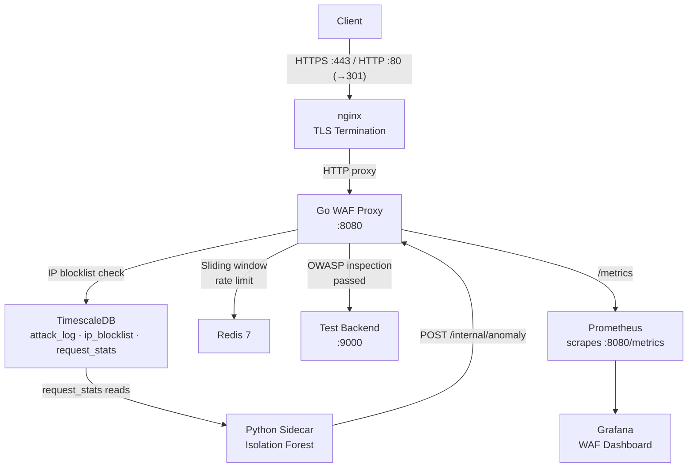

# NetSentinel

A self-hosted L7 Web Application Firewall and traffic inspection proxy built with Go, Python, TimescaleDB, Redis, Prometheus, and Grafana.

## Stack

| Component | Technology |
|---|---|
| Inspection Proxy | Go 1.26+, chi router, httputil.ReverseProxy |
| OWASP Detection | Custom rule engine — SQLi, XSS, Path Traversal, Command Injection, SSRF |
| Rate Limiting | Redis sliding window (100 req/60s per IP) |
| Behavioral Anomaly Detection | Python 3.13, Isolation Forest (scikit-learn) |
| Attack Log Store | TimescaleDB (PostgreSQL 16 hypertable) |
| Metrics | Prometheus + Grafana |
| TLS Termination | nginx (TLSv1.2/1.3) |
| Test Backend | Go HTTP server with naive endpoints |
| Container Runtime | Docker + Docker Compose |

## Architecture


## OWASP Detection Rules

| Rule ID | Category | Severity | Description |
|---|---|---|---|
| SQLI-001 | SQLi | CRITICAL | UNION SELECT, sleep(), DROP TABLE, etc. |
| SQLI-002 | SQLi | HIGH | SELECT FROM, WAITFOR DELAY, etc. |
| XSS-001 | XSS | HIGH | script tags, javascript:, event handlers |
| XSS-002 | XSS | MEDIUM | eval(), document.cookie, alert() |
| TRAVERSAL-001 | PathTraversal | HIGH | ../, /etc/passwd, /windows/system32 |
| CMDI-001 | CommandInjection | CRITICAL | ; cmd, && cmd, backtick, $() |
| SSRF-001 | SSRF | HIGH | Internal IP ranges, localhost, file:// |
| RESP-001 | ResponseLeak | MEDIUM | Stack traces, SQL errors in responses |

## WAF Modes

Set `WAF_MODE` in `.env`:
- `block` — malicious requests return 403, logged to TimescaleDB
- `monitor` — requests pass through, logged to TimescaleDB

## Quick Start

### Prerequisites
- Docker Desktop
- Go 1.26+
- Python 3.13+

### Run
```bash
git clone https://github.com/isshaan-dhar/NetSentinel
cd NetSentinel
cp .env.example .env
openssl req -x509 -nodes -days 365 -newkey rsa:2048 \
  -keyout nginx/certs/netsentinel.key \
  -out nginx/certs/netsentinel.crt \
  -subj "/CN=localhost"
docker compose up --build -d
```

### Test Attack Detection
```bash
# SQLi
curl -k "https://localhost/search?q=1'+union+select+*+from+users--"

# XSS
curl -k "https://localhost/search?q=<script>alert(1)</script>"

# Path Traversal
curl -k "https://localhost/page?path=../../etc/passwd"

# Command Injection
curl -k "https://localhost/exec?cmd=;cat+/etc/passwd"

# SSRF
curl -k "https://localhost/search?q=https://127.0.0.1/admin"
```

All should return `Forbidden`.

## Observability

| Service | URL |
|---|---|
| Grafana Dashboard | http://localhost:3000 (admin/admin) |
| Prometheus | http://localhost:9090 |
| WAF Health (via nginx) | https://localhost/health |
| WAF Metrics (via nginx) | https://localhost/metrics |

## Security Properties

- All traffic inspected at L7 before reaching upstream
- Request body, headers, URL, and query parameters all inspected
- Response body inspected for information leakage
- Per-IP sliding window rate limiting via Redis
- IP blocklist persisted in TimescaleDB
- All attacks logged to TimescaleDB hypertable with full metadata
- Behavioral anomaly detection via Isolation Forest on per-IP feature vectors
- TLS 1.2/1.3 enforced via nginx, HTTP redirected to HTTPS